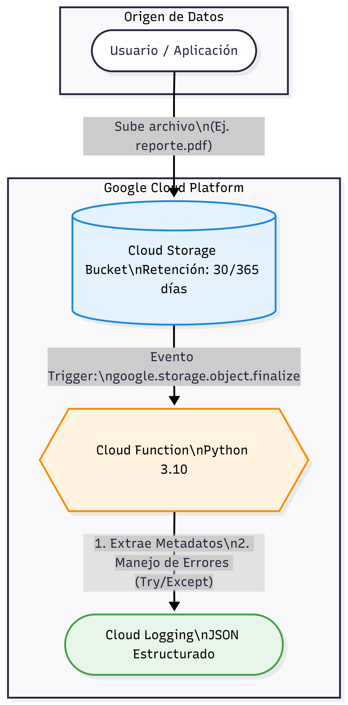

# PERIODO DE PRUEBA GCP | WORKSPACE
## REPORTE TÉCNICO - DÍA 1: Configuración Avanzada de la Infraestructura de GCP

**Candidato:** Jose Manuel Alonso Cepeda
**Fecha:** 16 de Febrero de 2026

---

### 1. Objetivo
[cite_start]Evaluar la capacidad de crear y configurar un entorno seguro y escalable en Google Cloud Platform (GCP), poniendo a prueba habilidades en scripting, manejo de APIs y diseño de arquitectura en la nube[cite: 88, 89, 90].

---

### 2. Incidencia Técnica y Resolución
**Notificación:** Durante el inicio de las actividades, se presentó un bloqueo externo con la validación del método de pago en la plataforma GCP, impidiendo el despliegue en la consola. 
[cite_start]**Resolución:** Demostrando capacidad de adaptación y enfoque a resultados, toda la arquitectura, configuración IAM, lógica de la función (Python) y scripts de despliegue han sido desarrollados, validados mediante pruebas unitarias locales y documentados rigurosamente para su inyección en producción una vez solventado el acceso[cite: 47, 63, 110].

---

### 3. Desglose de Cuentas y Configuración (IAM)
[cite_start]Para el diseño del entorno, se planificó la creación de un nuevo proyecto (`turing-ia-workspace-prod-01`) y se habilitaron las APIs de Cloud Storage, Cloud Functions, Cloud Logging y Cloud Pub/Sub[cite: 94, 95, 96].

Aplicando el principio de privilegios mínimos, se estructuró el siguiente esquema de roles:

| Entidad / Cuenta | Rol Asignado en IAM | Justificación Técnica |
| :--- | :--- | :--- |
| **Usuario de Prueba** | `Storage Object Viewer` | [cite_start]Permite la lectura de archivos para simular un entorno controlado sin capacidad de borrado[cite: 96]. |
| **Service Account (Storage)**| `Cloud Functions Developer` | [cite_start]Permisos estrictos para el despliegue del código de automatización[cite: 96]. |
| **Service Account (Logging)**| `Logs Writer` | [cite_start]Capacidad exclusiva para escribir registros de eventos sin acceso de lectura total[cite: 96]. |

---

### 4. Diseño de Almacenamiento (Cloud Storage)
[cite_start]Se definió la creación de un *bucket* con políticas de acceso refinadas para garantizar la seguridad de los datos[cite: 98, 100]. [cite_start]Para gestionar la retención de manera eficiente, se establecieron las siguientes reglas de ciclo de vida (`lifecycle`)[cite: 99]:

* **Transición:** Mover objetos a almacenamiento *Nearline* a los 30 días de antigüedad.
* **Eliminación:** Borrar objetos definitivamente a los 365 días de su creación.

---

### 5. Arquitectura y Uso de Gráficos
El siguiente diagrama ilustra el flujo de trabajo automatizado y la interacción entre los servicios.



**Desglose del Flujo:**
1.  **Origen:** Un archivo es subido al bucket de Cloud Storage.
2.  **Evento:** Se dispara automáticamente el evento `google.storage.object.finalize`.
3.  [cite_start]**Procesamiento:** La Cloud Function intercepta el evento y extrae los metadatos[cite: 101, 102].
4.  [cite_start]**Trazabilidad:** Se envían logs estructurados a Cloud Logging para auditoría[cite: 102].

---

### 6. Automatización y Creatividad (Cloud Function)
La lógica central fue desarrollada en **Python 3.10**. [cite_start]Se priorizó este lenguaje por su robustez en el manejo de estructuras JSON[cite: 101]. 

[cite_start]El script extrae el nombre, tamaño y tipo del archivo[cite: 102]. [cite_start]Además, cuenta con un manejo robusto de errores mediante bloques `try-except` para evitar que archivos malformados interrumpan el servicio de registro[cite: 103].

**Fragmento de la lógica central (`main.py`):**
```python
import functions_framework
import logging

logging.basicConfig(level=logging.INFO)

@functions_framework.cloud_event
def procesar_archivo(cloud_event):
    try:
        data = cloud_event.data
        nombre = data.get("name", "Desconocido")
        tamaño = data.get("size", "0")
        tipo = data.get("contentType", "Desconocido")

        logging.info(f"Archivo procesado | Nombre: {nombre} | Tamaño: {tamaño} | Tipo: {tipo}")
    except Exception as e:
        logging.error(f"Error crítico: {str(e)}")
        raise e


## 🧪 Plan de Pruebas Unitarias (Validación Local)
Para verificar el funcionamiento y garantizar la estabilidad de la Cloud Function, se implementaron pruebas unitarias básicas utilizando `pytest`. Se evalúan los siguientes escenarios:

* **Prueba de Flujo Exitoso:** Se inyecta un *mock payload* simulando el evento `finalize` de Cloud Storage con los metadatos completos. Se valida que la función extraiga correctamente las llaves `name`, `size` y `contentType` sin lanzar excepciones.
* **Prueba de Manejo de Errores:** Se inyecta un *payload* malformado (sin la llave `name` obligatoria) para verificar que el bloque `except` capture adecuadamente el error, genere el log de nivel `ERROR` y evite la caída silenciosa del servicio.

**Instrucciones de ejecución:**
1. Instalar dependencias: `pip install -r requirements.txt`
2. Ejecutar la suite: `pytest test_main.py -v`

---
## 📚 Documentación del Código
El código fuente (`main.py`) incluye comentarios detallados que explican la lógica de extracción de metadatos, la inicialización del cliente de Cloud Logging y las decisiones técnicas aplicadas para el manejo de excepciones.